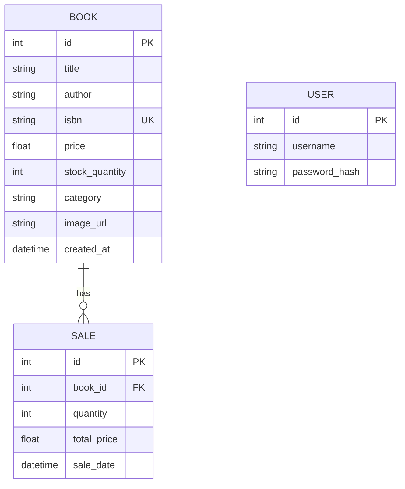
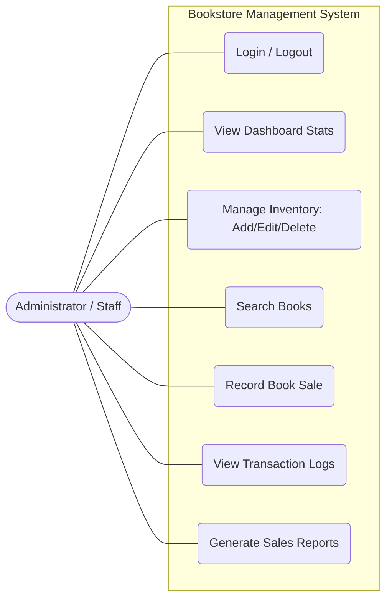

# Online Bookstore System Documentation

This document contains the structural and functional specifications of the Online Bookstore Management System.

## 1. Entity Relationship Diagram (ERD)

The system uses a relational database schema. Note: The **User** table is used for authentication and is logically separate from the inventory tables because it handles system-wide administration.

### Data Dictionary

| Table | Attribute | Type | Description |
|-------|-----------|------|-------------|
| **User** | id | Integer | Unique identifier for the admin. |
| | username | String | Login username. |
| | password_hash | String | Secured hashed password. |
| **Book** | id | Integer | Unique identifier for the book. |
| | title | String | Title of the book. |
| | author | String | Author of the book. |
| | isbn | String | International Standard Book Number. |
| | price | Float | Selling price per unit. |
| | stock_quantity| Integer | Number of copies available. |
| | category | String | Genre or category. |
| **Sale** | id | Integer | Unique transaction ID. |
| | book_id | Integer | Reference to the Book sold. |
| | quantity | Integer | Number of copies sold. |
| | total_price | Float | Total revenue from the sale. |
| | sale_date | DateTime | Timestamp of the transaction. |

---

## 2. Use Case Diagram

The following diagram illustrates the interactions between the System Administrator and the Bookstore Management System.

---

## 3. System Functional Modules

### A. Authentication Module
- **Admin Login:** Secure access using hashed passwords.
- **Session Management:** Tracks active users and prevents unauthorized access to management routes.

### B. Inventory Management
- **Add Book:** Allows entry of new titles with full details (ISBN, Price, Stock).
- **Edit Book:** Update existing stock details or pricing.
- **Delete Book:** Safely remove books from the system (cascading sale records are handled).

### C. Sales & Transaction Module
- **Point of Sale:** Record sales which automatically decrements inventory count.
- **Transaction Logs:** A historical record of every sale made through the system.

### D. Reporting & Analytics
- **Dashboard:** At-a-glance view of total books, low stock alerts, and today's revenue.
- **Reports:** Summarized data showing total overall revenue and top 5 selling books.

---

## 4. Technical Stack
- **Backend:** Python (Flask Framework)
- **Database:** SQLite (SQLAlchemy ORM)
- **Frontend:** HTML5, CSS3 (Vanilla JS for interactivity)
- **Authentication:** Flask-Login
